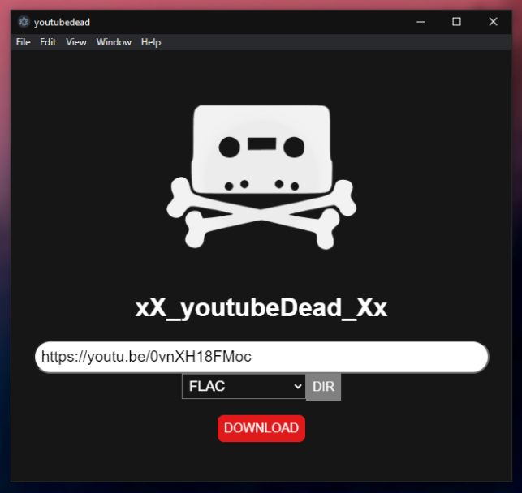

# youtubeDead



## What is this?

* Backup YouTube Content
* Outputs high quality FLAC audio
* Backup entire playlists
* Easy setup, no external dependencies or configuration

This is a tool for making local backups of YouTube content. **This software is provided for demonstration only.**

This software is a front-end for [youtube-dl](https://github.com/ytdl-org/youtube-dl/blob/master/README.md#readme) (CC), which is included in executable (and source) so that the end-user does not need to install it or add it to their path. This software also includes the [LIBAV](http://builds.libav.org/windows/release-gpl/) (GPL) files needed for converting downloaded audio. 

## What kind of backups can I make?

At the time of this writing, this software is focused on making audio backups only. The are options to select formats other than FLAC but they are currently not working.

## No Linux Or MacOS?

I ❤️ Linux, but **youtubeDead** is being written for Windows and will probably never support other operating systems because of differences in 3rd party audio conversion software. 

---

## Development setup
```
npm install
```

### Compiles and hot-reloads for development
```
npm run serve
```

### Compiles and minifies for production
```
npm run build
```

### Lints and fixes files
```
npm run lint
```

### Serves Electron
```
npm run electron:serve
```

### Builds Electron
```
npm run electron:build
```

### Customize configuration
See [Configuration Reference](https://cli.vuejs.org/config/).
